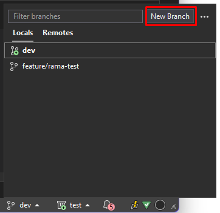

1 - Crea una cuenta de github

2 - Dirigete a la [página del repositorio](https://github.com/smaicas-org/Dnj.Colab) y pulsa "Create a new Fork"


Esto creara una copia del repositorio original en tu cuenta.
Navega al repositorio recien creado y pulsa sobre el botón "Code".
Copia la URL del repositorio.

3 - Clona el repositorio manualmente o utilizando un software como Visual Studio:

- Manualmente:	
REPOSITORY URL debe seguir el formato  https://USERNAME@github.com/source/path.git para especificar el nombre de usuario.
```
git clone {REPOSITORY URL}
```
- Usando VS:


4 - Implementa los cambios situado sobre la rama 'dev' de tu repositorio. 

5 - Una vez tus cambios están preparados para subir unirse al repositorio original.
Crea una nueva rama con base en 'dev' en tu repositorio. 
(Puedes hacerlo manualmente o utilizando software como Fork, SourceTree o tu IDE favorito)

- Manualmente:
```
git checkout dev
```
```
git switch -c "feature/mybranchname"
```
- Usando VS:




6 - Haz 'Commit' y 'Push' de los cambios sobre la rama creada.

- Manualmente:
```
git add .
```
```
git commit -m "COMMIT MESSAGE WITH LITTLE DESCRIPTION OF THE CHANGES"
```
```
git push origin "feature/mybranchname"
```
_Se abrirá una ventana para acceder con tu usuario_ 
    
7 - Ve a Github e inicia una 'Pull Request'


Tu PR será revisada y recibiras la información de si se deben efectuar cambios
sobre tu código o si ha sido aprobada y unida al repositorio original.
