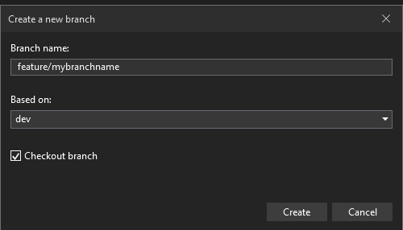

Introducción
============

Este repositorio pretende ser un punto de encuentro para programadores de todos los niveles. 
La idea es no solo aprender a programar si no aprender integración de código, conocer y adoptar una manera de trabajar profesional. 
Adecuada a la manera que se trabaja en una empresa. Es un repositorio de codigo abierto y cualquier persona está invitada a colaborar.

No hay restricción de lenguajes o frameworks.
Si deseas aportar código de otros lenguajes o frameworks que no se encuentran actualmente
categorizados en el repositorio adelante. 
En ese caso sería interesante que tú mismo fueras el responsable de la revisión de código para
esas categorías. Ponte en contacto para gestionar los permisos (https://discord.gg/rPF39zRWQp)
* * *

Contenido
=========

* * *

Como colaborar?
================

1 - Crea una cuenta de github

2 - Dirigete a la [página del repositorio](https://github.com/smaicas-org/Dnj.Colab) y pulsa "Create a new Fork"


Esto creara una copia del repositorio original en tu cuenta.
Navega al repositorio recien creado y pulsa sobre el botón "Code".
Copia la URL del repositorio.

3 - Clona el repositorio manualmente o utilizando un software como Visual Studio:
- Manualmente:	
REPOSITORY URL debe seguir el formato  https://USERNAME@github.com/source/path.git para especificar el nombre de usuario.
```
git clone {REPOSITORY URL}
```
- Usando VS:


4 - Implementa los cambios situado sobre la rama 'dev' de tu repositorio. 

5 - Una vez tus cambios están preparados para subir unirse al repositorio original.
Crea una nueva rama con base en 'dev' en tu repositorio. 
(Puedes hacerlo manualmente o utilizando software como Fork, SourceTree o tu IDE favorito)
- Manualmente:
```
git checkout dev
```
```
git switch -c "feature/mybranchname"
```
- Usando VS:




6 - Haz 'Commit' y 'Push' de los cambios sobre la rama creada.
- Manualmente:
```
git add .
```
```
git commit -m "COMMIT MESSAGE WITH LITTLE DESCRIPTION OF THE CHANGES"
```
```
git push origin "feature/mybranchname"
```
_Se abrirá una ventana para acceder con tu usuario_ 
    
7 - Ve a Github e inicia una 'Pull Request'


Tu PR será revisada y recibiras la información de si se deben efectuar cambios
sobre tu código o si ha sido aprobada y unida al repositorio original.


### Creando un proyecto

*   Crea el proyecto en la carpeta de soluciones de acuerdo al tipo de proyecto que implementes.
*   Copie y complete el `README-Sample.md` ubicado en la carpeta Documentación. Cámbiele el nombre a `README.md` y ponlo en la raíz de su proyecto.

* * *

Documentación externa
=====================

[C# Referencia del lenguaje](https://learn.microsoft.com/en-us/dotnet/csharp/language-reference/)

[.NET Documentación](https://learn.microsoft.com/en-us/dotnet/)

[Blazor Documentación](https://learn.microsoft.com/es-es/aspnet/core/blazor/?view=aspnetcore-7.0)

[MAUI Documentación](https://learn.microsoft.com/en-us/dotnet/maui/?view=net-maui-7.0)

* * *